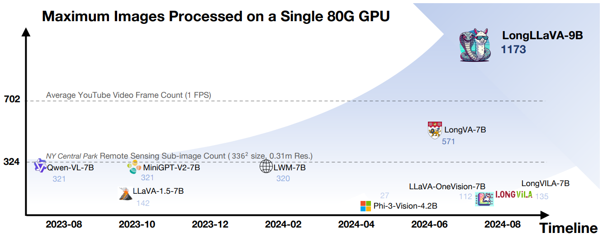
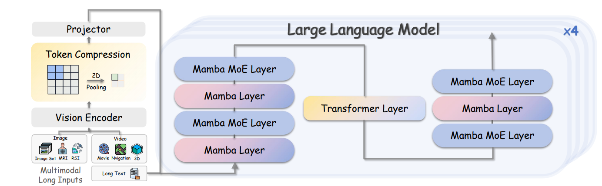
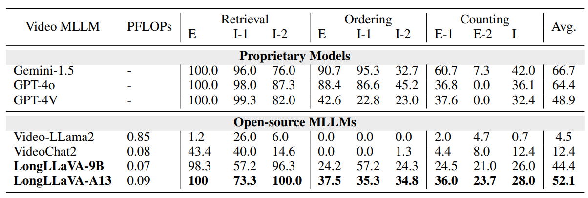
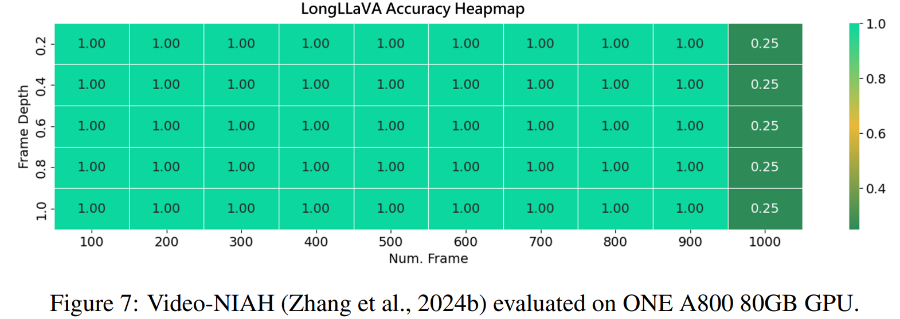
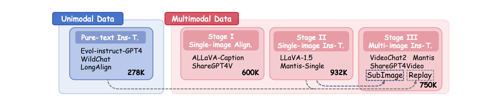

 

<p align="center">
   📃 <a href="" target="_blank">Paper</a> • 🌐 <a href="" target="_blank">Demo</a> • 🤗 <a href="https://huggingface.co/FreedomIntelligence/LongLLaVA" target="_blank">LongLLaVA</a> 
</p>

 

## 🌈 Update

* **[2024.09.05]** LongLLaVA repo is published！🎉 The Code will

## Architecture

<details>
  <summary>Click to view the architecture image</summary>

  

</details>


## Results

<details>
  <summary>Click to view the Results</summary>

  - Main Results
       
  - Diagnostic Results
      
  - Video-NIAH
      

</details>


## Results reproduction

### Data DownLoad and Construction

<details>
  <summary>Dataset Taxonomy</summary>

   

</details>

<details>
  <summary>Dataset DownLoading and Construction</summary>

   > Coming Soon~

</details>


### Training

> Coming Soon~

- Stage I: Single-image Alignment.
  ```bash
  bash Pretrain.sh
  ```
- Stage II: Single-image Instruction-tuning.
  ```bash
  bash SingleImageSFT.sh
  ```
- Stage III: Multi-image Instruction-tuning. 
  ```bash
  bash MultiImageSFT.sh
  ```

### Evaluation

> Coming Soon~

```bash
bash Eval.sh
```

## TO DO

- [ ] Release Model Evalation Code
- [ ] Release Data Construction Code
- [ ] Release Model Training Code

## Acknowledgement

- [LLaVA](https://github.com/haotian-liu/LLaVA): Visual Instruction Tuning (LLaVA) built towards GPT-4V level capabilities and beyond.

## Citation

```
@misc{wang2024longllavascalingmultimodalllms,
      title={LongLLaVA: Scaling Multi-modal LLMs to 1000 Images Efficiently via Hybrid Architecture}, 
      author={Xidong Wang and Dingjie Song and Shunian Chen and Chen Zhang and Benyou Wang},
      year={2024},
      eprint={2409.02889},
      archivePrefix={arXiv},
      primaryClass={cs.CL},
      url={https://arxiv.org/abs/2409.02889}, 
}


```
