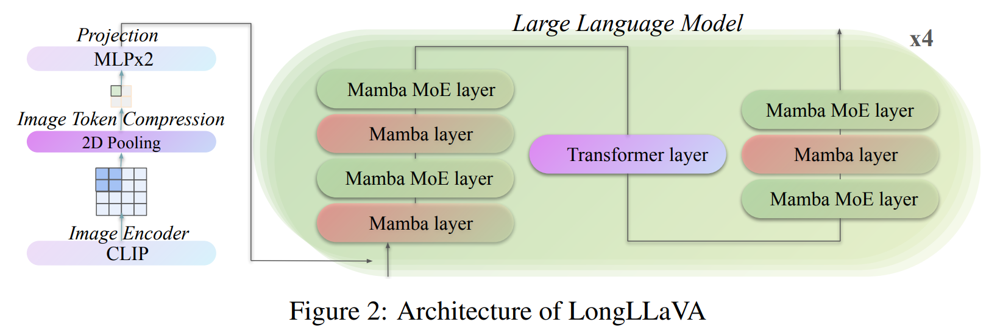

<div style="display: flex; align-items: center;">
    
    <h1>LongLLaVA: Scaling Multi-modal LLMs to 1000 Images Efficiently via Hybrid Architecture</h1>
</div>

<p align="center">
   📃 <a href="" target="_blank">Paper</a> • 🌐 <a href="" target="_blank">Demo</a> • 🤗 <a href="https://huggingface.co/FreedomIntelligence/LongLLaVA" target="_blank">LongLLaVA</a> 
   <br>  <a href=""> 中文 </a> | <a href=""> English
</p>
 

## 🌈 Update

* **[2024.09.05]** LongLLaVA repo is published！🎉 The Code will

## Architecture

<details>
  <summary>Click to view the architecture image</summary>

  

</details>


## Results

<details>
  <summary>Click to view the Results</summary>
   
  
  
</details>


## Results reproduction

### Data DownLoad and Construction

<details>
  <summary>Dataset Taxonomy</summary>
   
</details>

<details>
  <summary>Data Construction Code</summary>
  Coming Soon~
</details>

### Training

Coming Soon~

- Stage I: Single-image Alignment.
  ```bash
  bash Pretrain.sh
  ```
- Stage II: Single-image Instruction-tuning.
  ```bash
  bash SingleImageSFT.sh
  ```
- Stage III: Multi-image Instruction-tuning. 
  ```bash
  bash MultiImageSFT.sh
  ```

### Evaluation

Coming Soon~

```bash
bash Eval.sh
```

## TO DO

- [ ] Release Model Evalation Code
- [ ] Release Data Construction Code
- [ ] Release Model Training Code

## Acknowledgement

- [LLaVA](https://github.com/haotian-liu/LLaVA): Visual Instruction Tuning (LLaVA) built towards GPT-4V level capabilities and beyond.

## Citation

Coming Soon~


```


```
